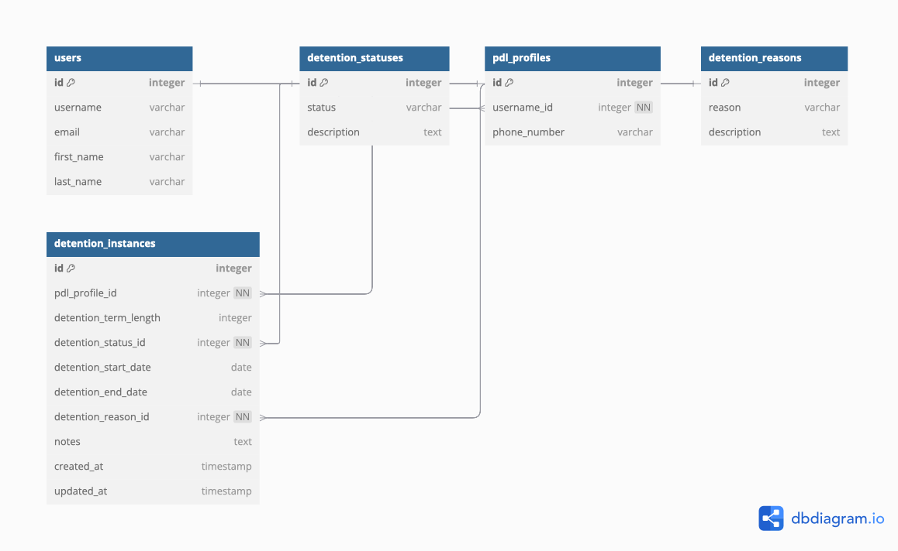

# PDL App

The `pdl` app handles transactions related to PDLs (persons deprived of liberty) and their associated data. It is designed to manage the lifecycle of PDLs, including their creation, updates, and deletions.

## SQL Data Model

### `DetentionStatus`

Represents the status of a detention.

- **Fields**:
  - `status (CharField)`: The name of the detention status (max length: 100).
  - `description (TextField)`: A description of the detention status.

- **Meta Options**:
  - `verbose_name`: "Detention Status".
  - `verbose_name_plural`: "Detention Statuses".

- **Methods**:
  - `__str__`: Returns the name of the detention status.

---

### `PDLProfile`

Represents a profile for a PDL (Person Deprived of Liberty).

- **Fields**:
  - `username (ForeignKey)`: A reference to the `User` model.
  - `phone_number (CharField)`: The phone number of the PDL (optional, max length: 15).

- **Meta Options**:
  - `verbose_name`: "PDL Profile".
  - `verbose_name_plural`: "PDL Profiles".

- **Methods**:
  - `__str__`: Returns the full name of the PDL (first name and last name).

---

### `DetentionReason`

Represents a reason for detention.

- **Fields**:
  - `reason (CharField)`: The reason for the detention (max length: 255).
  - `description (TextField)`: A description of the detention reason.

- **Meta Options**:
  - `verbose_name`: "Detention Reason".
  - `verbose_name_plural`: "Detention Reasons".

- **Methods**:
  - `__str__`: Returns the reason for detention.

---

### `DetentionInstance`

Represents an instance of detention for a PDL.

- **Fields**:
  - `pdl_profile (ForeignKey)`: A reference to the `PDLProfile` model.
  - `detention_term_length (IntegerField)`: The length of the detention term (default: 0).
  - `detention_status (ForeignKey)`: A reference to the `DetentionStatus` model.
  - `detention_start_date (DateField)`: The start date of the detention.
  - `detention_end_date (DateField)`: The end date of the detention (optional).
  - `detention_reason (ForeignKey)`: A reference to the `DetentionReason` model.
  - `notes (TextField)`: Additional notes about the detention (optional).
  - `created_at (DateTimeField)`: The timestamp when the detention instance was created.
  - `updated_at (DateTimeField)`: The timestamp when the detention instance was last updated.

- **Meta Options**:
  - `verbose_name`: "Detention Instance".
  - `verbose_name_plural`: "Detention Instances".
  - `ordering`: Ordered by `-detention_start_date` (descending).

- **Methods**:
  - `__str__`: Returns a string representation of the detention instance, including the PDL profile, detention status, and start date.

## User Interface and User Experience