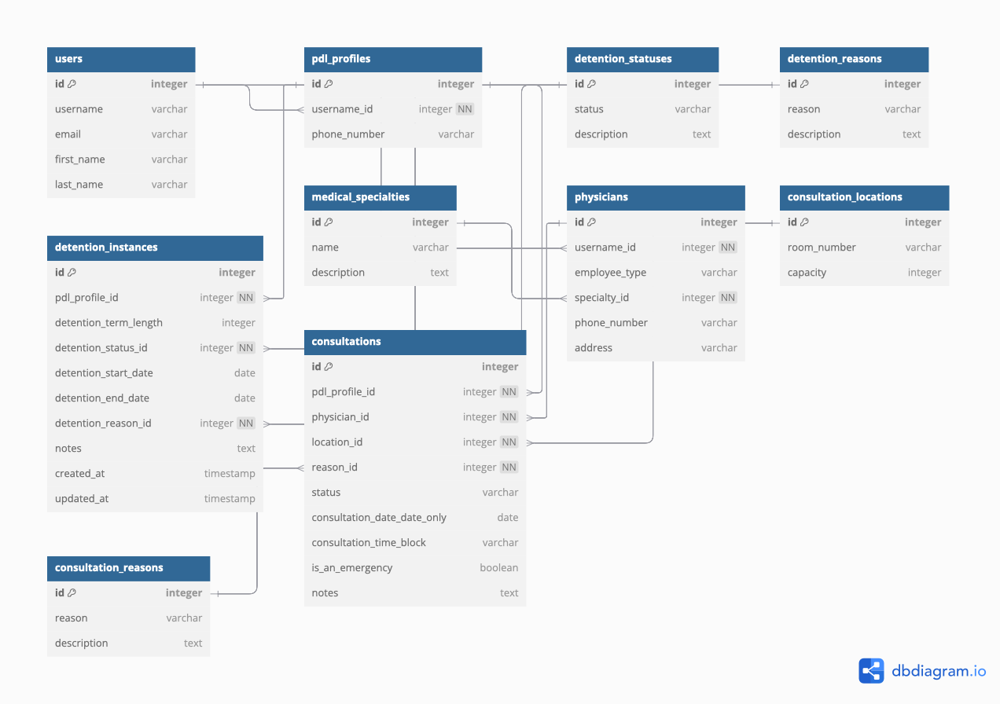

## Data model



##  Views, URLS and Forms

### `consultation_calendar`

Generates a calendar view for consultations within a specified month and year.

**Args**:
- `request (HttpRequest)`: The HTTP request object containing optional `year` and `month` query parameters to specify the calendar's year and month. Defaults to the current year and month if not provided.
- `consultations (QuerySet)`: A queryset of consultation objects, each containing a `consultation_date_date_only` attribute representing the date of the consultation.

**Returns**:
- `dict`: A context dictionary containing:
  - `calendar_data (list)`: A list of weeks, where each week is a list of dictionaries representing days.
  - `year (int)`: The year of the calendar.
  - `month (int)`: The month of the calendar.
  - `month_name (str)`: The full name of the month.
  - `prev_month (int)`: The previous month (1-12).
  - `prev_year (int)`: The year corresponding to the previous month.
  - `next_month (int)`: The next month (1-12).
  - `next_year (int)`: The year corresponding to the next month.

---

### `all_consultations`

Handles the retrieval and display of all consultations.

**Args**:
- `request (HttpRequest)`: The HTTP request object.

**Returns**:
- `HttpResponse`: The rendered consultation calendar template with the context containing consultation data.

---

### `consultations_by_physician`

Handles the retrieval and display of consultations for a specific physician.

**Args**:
- `request (HttpRequest)`: The HTTP request object.
- `physician_id (int)`: The ID of the physician whose consultations are to be retrieved.

**Returns**:
- `HttpResponse`: A rendered HTML page displaying the consultation calendar for the specified physician.

**Raises**:
- `Http404`: If no `Physician` object with the given ID is found.

---

### `doctor_dashboard`

Displays the doctor's dashboard with relevant information.

**Args**:
- `request (HttpRequest)`: The HTTP request object.

**Returns**:
- `HttpResponse`: The rendered HTML template for the doctor's dashboard.

**Context**:
- `physician (Physician)`: The physician object for 'jessicaadams'.
- `upcoming_consultations (QuerySet)`: A queryset containing up to three upcoming consultations for the physician, sorted by date and time.

---

### `schedule_consultation`

Handles the scheduling of a consultation.

**Args**:
- `request (HttpRequest)`: The HTTP request object containing metadata about the request.

**Returns**:
- `HttpResponse`: Renders the consultation scheduling page with the form for GET requests or redirects to the consultation calendar for valid POST requests.

---

### `cancel_consultation`

Handles the cancellation of a consultation.

**Args**:
- `request (HttpRequest)`: The HTTP request object.
- `consultation_id (int)`: The ID of the consultation to be canceled.

**Returns**:
- `HttpResponse`: Renders the cancellation confirmation page if the request method is not POST. Redirects to the consultation calendar if the consultation is successfully canceled.

---

### `reschedule_consultation`

Handles the rescheduling of a consultation.

**Args**:
- `request (HttpRequest)`: The HTTP request object containing metadata about the request.
- `consultation_id (int)`: The ID of the consultation to be rescheduled.

**Returns**:
- `HttpResponse`: Renders the reschedule consultation page with the form if the request is not a POST, or redirects to the consultation calendar upon successful form submission.

**Raises**:
- `Http404`: If the consultation with the given ID does not exist.

**Template**:
- `consultations/reschedule_consultation.html`

**Context**:
- `form (ScheduleConsultationForm)`: The form for scheduling the consultation.
- `consultation (Consultation)`: The consultation object being rescheduled.

## Consultations App URL Configuration

This module defines the URL patterns for the `consultations` app, mapping specific URL paths to their corresponding view functions. These URLs handle various functionalities such as viewing the doctor dashboard, managing consultation schedules, and handling consultation cancellations and rescheduling.

### Routes

- **`doctor-dashboard`**: Displays the doctor's dashboard.
- **`calendar/`**: Displays all consultations in a calendar view.
- **`calendar-physician/<int:physician_id>/`**: Displays consultations filtered by a specific physician.
- **`schedule/`**: Allows scheduling a new consultation.
- **`cancel/<int:consultation_id>/`**: Cancels a specific consultation.
- **`reschedule/<int:consultation_id>/`**: Reschedules a specific consultation.

### Namespace

- **`app_name`**: `'consultations'` (used for namespacing URLs in templates and reverse lookups).

### URL Patterns

```python
from django.urls import path
from . import views

app_name = 'consultations'

urlpatterns = [
    path('doctor-dashboard', views.doctor_dashboard, name='doctor_dashboard'),
    path('calendar/', views.all_consultations, name='consultation_calendar'),
    path('calendar-physician/<int:physician_id>/', views.consultations_by_physician, name='consultation_calendar_physician'),
    path('schedule/', views.schedule_consultation, name='schedule_consultation'),
    path('cancel/<int:consultation_id>/', views.cancel_consultation, name='cancel_consultation'),
    path('reschedule/<int:consultation_id>/', views.reschedule_consultation, name='reschedule_consultation'),
    # Other URLs...
]
```